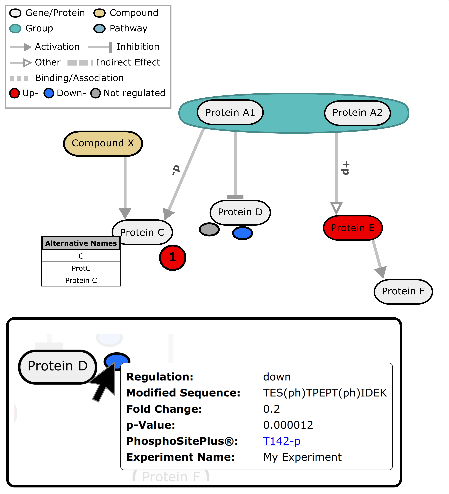

# biowc-pathwaygraph

[](https://www.npmjs.com/package/@biowc/pathwaygraph)
[](https://www.npmjs.com/package/@biowc/pathwaygraph)
[](https://www.apache.org/licenses/LICENSE-2.0)
[](https://www.npmjs.com/package/d3/v/6.2.0)
[](https://www.npmjs.com/package/lit/v/2.0.2)

`biowc-pathwaygraph` is a WebComponent for interactive visualization of signaling pathway diagrams.
In addition to rendering the genes, proteins and compounds within a pathway, PTM and expression data can be projected onto the diagram.  

<p>

</p>

Our  `storybook` contains an overview of the features of `biowc-pathwaygraph`. Here's how to run it:  
1. Clone this repository
2. Install the dependencies: `npm install`
3. Start Storybook: `npm run storybook` 

This webcomponent follows the [open-wc](https://github.com/open-wc/open-wc) recommendation.

## Installation

```bash
npm i biowc-pathwaygraph
```

## Usage

Please check `demo/index.html` for a minimal working example.

## Linting and formatting

To scan the project for linting and formatting errors, run

```bash
npm run lint
```

To automatically fix linting and formatting errors, run

```bash
npm run format
```

## Testing with Web Test Runner

To execute a single test run:

```bash
npm run test
```

To run the tests in interactive watch mode run:

```bash
npm run test:watch
```


## Tooling configs

For most of the tools, the configuration is in the `package.json` to reduce the amount of files in your project.

If you customize the configuration a lot, you can consider moving them to individual files.

## Local Demo with `web-dev-server`

```bash
npm start
```

To run a local development server that serves the basic demo located in `demo/index.html`

## Reference
If `biowc-pathwaygraph` is useful for your research, please cite the following publication:  

 **PTMNavigator: Interactive Visualization of Differentially Regulated Post-Translational Modifications in Cellular Signaling Pathways**  
Julian Müller, Florian P. Bayer, Mathias Wilhelm, Bernhard Kuster, Matthew The  
_bioRxiv_ 2023.08.31.555601; doi: https://doi.org/10.1101/2023.08.31.555601
